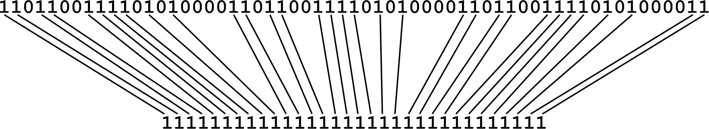
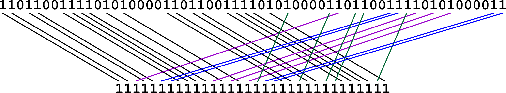

# VSTseed

Software tools to find optimal spaced seeds.

<nav>
  <ul>
    <li><a href="#link_fa2bin">fa2bin: Convert a reference sequence into a binary file</a></li>
    <li><a href="#link_periodicSeed">findPeriodicSeedLen: Find periodic spaced seeds for reads of given lengths</a></li>
    <li><a href="#link_bestSeed">bestSeed: Find spaced seeds of given weights and known number of mismatches</a></li>
    <li><a href="#link_spaced2contig">seed2simd: Converting spaced seeds to contiguous arrays</a></li>
    <li><a href="#link_ref2chunk">ref2chunk: Create a list of pairs (position, signature)</a></li>
    <li><a href="#link_chunk2sort">chunk2sort: Sort the list of pairs (position, signature)</a></li>
  </ul>
  </nav>

<h2 id="link_fa2bin">fa2bin</h2>

Suppose a reference genome is a sequence of 5 letters (<b>A</b>, <b>C</b>, <b>G</b>, <b>T</b> and <b>N</b>, where <b>N</b> is any of four symbols). We split the sequence into groups of 32 symbols. We write this 32-symbol sequence as a 128-bit number. An <i>i</i>-th bit from the first 32 bits is 1 if the <i>i</i>-th symbol in the sequence is <b>A</b>, otherwise it is 0. The next 32 bits are for symbol <b>C</b>, then for symbol <b>G</b> and <b>T</b> respectively. If there is a symbol <b>N</b>, then all bits in <b>A</b>, <b>C</b>, <b>G</b> and <b>T</b> arrays are 0.

<b>Example 1</b>

Let us have the following sequence of 32 symbols: <tt>CATAGNCACGTGATCCTAGNCATGTTACCTGT</tt>.

<table>
  <tr>
    <th>m1</th>
    <th><tt>CATAGNCACGTGATCCTAGNCATGTTACCTGT</tt></th>
    <th></th>
  </tr>
  <tr>
    <th><i>A</i></th>
    <th><tt>01010001000010000100010000100000</tt></th>
    <th><tt>0x0422108a</tt></th>
  </tr>
  <tr>
    <th><i>C</i></th>
    <th><tt>10000010100000110000100000011000</tt></th>
    <th><tt>0x1810c141</tt></th>
  </tr>
  <tr>
    <th><i>G</i></th>
    <th><tt>00001000010100000010000100000010</tt></th>
    <th><tt>0x40840a10</tt></th>
  </tr>
  <tr>
    <th><i>T</i></th>
    <th><tt>00100000001001001000001011000101</tt></th>
    <th><tt>0xa3412404</tt></th>
    </tr>
  <tr>
    <th><i>A|C|G|T</i></th>
    <th><tt>11111011111111111110111111111111</tt></th>
    <th><tt>0xfff7ffdf</tt></th>
  </tr>
  </table>

We may set the above letter using <a href="https://software.intel.com/sites/landingpage/IntrinsicsGuide/">Intel Intrinsics</a>

  <tt>__m128i m1 = _mm_set_epi32(0xa3412404, 0x40840a10, 0x1810c141, 0x0422108a);</tt>
  

<b>Example 2</b>

Suppose we have two 32-symbol sequences (<tt>m1</tt> is shown above and <tt>m2</tt> is below).

<table>
  <tr>
    <th>m2</th>
    <th><tt>GCCTCAGTTTTCACTCTATCAATATGTAATAA</tt></th>
    <th></th>
  </tr>
  <tr>
    <th><i>A</i></th>
    <th><tt>00000100000010000100110100011011</tt></th>
    <th><tt>0xd8b21020</tt></th>
  </tr>
  <tr>
    <th><i>C</i></th>
    <th><tt>01101000000101010001000000000000</tt></th>
    <th><tt>0x0008a816</tt></th>
  </tr>
  <tr>
    <th><i>G</i></th>
    <th><tt>10000010000000000000000001000000</tt></th>
    <th><tt>0x02000041</tt></th>
  </tr>
  <tr>
    <th><i>T</i></th>
    <th><tt>00010001111000101010001010100100</tt></th>
    <th><tt>0x25454788</tt></th>
    </tr>
  <tr>
    <th><i>A|C|G|T</i></th>
    <th><tt>11111111111111111111111111111111</tt></th>
    <th><tt>0xffffffff</tt></th>
  </tr>
  </table>

We want to count the total number of symbols <b>A</b>, <b>C</b>, <b>G</b>, <b>T</b> that are at same positions for the both sequences. For this purcpose we perform a bitwise AND operation using <tt>_mm_and_si128</tt>, perform bitwise OR operation for <b>A</b>, <b>C</b>, <b>G</b>, <b>T</b> components and count the number of ones in the resulting 32-bit number using <tt>_mm_popcnt_u32</tt>.

<table>
  <tr>
    <th></th>
    <th></th>
    <th>A</th>
    <th>C</th>
    <th>G</th>
    <th>T</th>
  </tr>
  <tr>
    <th><tt>m1</tt></th>
    <th><tt>CATAGNCACGTGATCCTAGNCATGTTACCTGT</tt></th>
    <th><tt>0x0422108a</tt></th>
    <th><tt>0x1810c141</tt></th>
    <th><tt>0x40840a10</tt></th>
    <th><tt>0xa3412404</tt></th>
  </tr>
  <tr>
    <th><tt>m2</tt></th>
    <th><tt>GCCTCAGTTTTCACTCTATCAATATGTAATAA</tt></th>
    <th><tt>0xd8b21020</tt></th>
    <th><tt>0x0008a816</tt></th>
    <th><tt>0x02000041</tt></th>
    <th><tt>0x25454788</tt></th>
  </tr>
  <tr>
    <th><tt>m1 AND m2</tt></th>
    <th><tt>__________T_A__CTA___AT_T____T__</tt></th>
    <th><tt>0x00221000</tt></th>
    <th><tt>0x00008000</tt></th>
    <th><tt>0x00000000</tt></th>
    <th><tt>0x21410400</tt></th>
  </tr>
  <tr>
    <th colspan="6"><tt>0x00221000 OR 0x00008000 OR 0x00000000 OR 0x21410400 = 0x21639400</tt></th>
  </tr>
  <tr>
    <th colspan="6"><tt>_mm_popcnt_u32(0x21639400) = 9</tt></th>
  </tr>
</table>

Conversion of a reference genome to the proposed binary format. The reference genome is in FASTA format. The code was tested with the human reference genome <a href="http://ftp.ebi.ac.uk/pub/databases/gencode/Gencode_human/release_37/GRCh38.p13.genome.fa.gz">http://ftp.ebi.ac.uk/pub/databases/gencode/Gencode_human/release_37/GRCh38.p13.genome.fa.gz</a>

Reference genome files may contain long contiguous subsequences of symbol <b>N</b> which may not be used for read alignment algorithms. Therefore those subseqiences are removed. On the other hand, sequences for two neighbouring chromosomes may be too close to each other, so we pad each chromosome (or other separated sequences in FASTA files) with extra <b>N</b> symbols. In order to know the orginal positions we create an index file.

<h3>Parameters</h3>

<ol>
  <li>A reference genome (FASTA file)</li>
  <li>Path to the output binary file</li>
  <li>Path to the output index file</li>
</ol>

<tt>C:\Temp2\Genome\Ref37\GRCh38.p13.genome.fa C:\Temp2\Genome\Ref37\human.bin C:\Temp2\Genome\Ref37\human.txt</tt>

<h2 id="link_periodicSeed">findPeriodicSeedLen</h2>

A seed is an array of binary elements, i.e. each element is either 1 or 0. It is assumed that the first and last elements of the array are 1. The <b>length</b> of the seed is the number of elements in the array, the <b>weight</b> of the seed is the number of 1s. For example, we have a seed
<tt>111001011100101110010111001011</tt>, its length is 30 and its weight is 18. 

Suppose there are two genomic sequences (one is a very long reference sequence, e.g. billions of elements, the other is a in times shorter one (a read), e.g. tens or hundreds of elements). We aim to find such positions of the reference array where the both arrays have as many same elements as possible. However, in real problems the reference sequence is unknown and we are only given a reference sequence which differs from the unknown one (one letter mismatches, insertions, deletions, etc.). To align a read with respect to a known reference sequence we may find positions of shorter subsequences for the both arrays. For example, a read contains 100 symbols (<b>A</b>, <b>C</b>, <b>G</b>, <b>T</b> and <b>N</b>). We may then take the first 20 symbols of the read and check where this subsequence is present in the reference sequence. For this purcpose we create an index file for the reference sequence. Shorter subsequences allow us to have a relatively small index file, however there may be a lot of candidate positions to be processed. At the same time due to various mutations in some cases a read may not be able to align in suach a way that all symbols are at the same positions. In most cases those differences are single symbol mismatches. Therefore instead of a contiguous subsequnce we may use subsequences with gaps (or a spaced seed).

For reads of given given lengths and known number of mismatches spaced seeds of greater weight are possible compared to contiguous seeds.

<b>Example 3</b>

Let there 

We call seeds <b>periodic</b> seeds if they can be represented as concatenated same arrays. The above seed is a periodic one with period <tt>1110010</tt>, since it can be written as <tt>1110010_1110010_1110010_1110010_11</tt>. Of course, any seed is a periodic one as we may always use the whole array as a periodic structure (repeated only once).

<h2 id="link_bestSeed">bestSeed</h2>

<h2 id="link_spaced2contig">seed2simd: Coverting spaced seeds to contiguous arrays</h2>

Let there be a spaced seed (an array of ones and zeros). For example,

<tt>11011001111010100001101100111101010000110110011110101000011</tt>

The length of the seed is 59 and its weight (number of 1s) is 32. We want to rearrange indices of the original seed and form a contiguous pattern of length/weight 32. The simplest approach is just remove all zero elements and preserve the order of 1s like below.

However, for the given spaced seed we will need at least 14 shift operations as there are 15 contiguous chunks of zeros.

We aim to use 128-bit SIMD instructions. Therefore we pad the original seed with zeros, so the new seed length is a multiple of 32 (64 for the given example) and split it into 32-bit arrays (each array corresponds to a new row):
<table>
  <tr>
    <th>row 1:</th>
    <th><tt>11011001111010100001101100111101</tt></th>
  </tr>
  <tr>
    <th>row 2:</th>
    <th><tt>01000011011001111010100001100000</tt></th>
  </tr>
</table>
We may try to solve the problem by the following approach. All 1s of the first row do not change their position, we translate the second row with respect to the first one and try to find such shifts, so 1s of the second row are just below 0s of the first row. We need to perform multiple shifts. One possible combination of shifts is shown below
<table>
  <tr>
    <th></th>
    <th></th>
    <th><tt>________11011001111010100001101100111101_______________</tt></th>
  </tr>
  <tr>
    <th>shift</th>
    <th>-8</th>
    <th><tt>01000011011001111010100001100000_______________________</tt></th>
  </tr>
  <tr>
    <th>shift</th>
    <th>-5</th>
    <th><tt>___01000011011001111010100001100000____________________</tt></th>
  </tr>
  <tr>
    <th>shift</th>
    <th>15</th>
    <th><tt>_______________________01000011011001111010100001100000</tt></th>
  </tr>
  </table>

After masking has been applied to the second row we have

<table>
  <tr>
    <th></th>
    <th></th>
    <th><tt>________11011001111010100001101100111101_______________</tt></th>
  </tr>
  <tr>
    <th>shift</th>
    <th>-8</th>
    <th><tt>0_0000__0__0011__0_0_00001100000_______________________</tt></th>
  </tr>
  <tr>
    <th>shift</th>
    <th>-5</th>
    <th><tt>___0_0000_10__00___101010000__00000____________________</tt></th>
  </tr>
  <tr>
    <th>shift</th>
    <th>15</th>
    <th><tt>_______________________0100001_01100__1_0_0_0000__00000</tt></th>
  </tr>
  </table>
  
The final mapping is shown below.

The corresponding conversion of the spaced seed (two 128-bit elements <tt>m</tt>) into a contiguous array (one 128-bit element <tt>res</tt>) can be written with SIMD instructions.
<pre>
__m128i c, t, s;
c = _mm_set1_epi32(0xbcd8579b);
res[0] = _mm_and_si128(m[0], c);
c = _mm_set1_epi32(0x06006000);
t = _mm_and_si128(m[1], c);
s = _mm_srli_epi32(t, 8);
res[0] = _mm_or_si128(res[0], s);
c = _mm_set1_epi32(0x00150080);
t = _mm_and_si128(m[1], c);
s = _mm_srli_epi32(t, 5);
res[0] = _mm_or_si128(res[0], s);
c = _mm_set1_epi32(0x00008642);
t = _mm_and_si128(m[1], c);
s = _mm_slli_epi32(t, 15);
res[0] = _mm_or_si128(res[0], s);
</pre>
Please, note that there may be several conversions. 

<h3>Parameters</h3>

<ol>
  <li>Input spaced seed</li>
  <li>Path to the output text file</li>
</ol>

<tt>11011001111010100001101100111101010000110110011110101000011 D:\Genome\simd\testSimd.txt</tt>

<h2 id="link_ref2chunk">ref2chunk</h2>

For given spaced seed of weight K and reference sequence we create a list of pairs <i>position</i>, <i>number</i>. For a given position we get K symbols (possibly separated by other symbols, the pattern is defined by a given spaced seed). If any of these K symbols is <b>N</b>, then we do not generate a pair. All positions are coded as 32-bit <tt>unsigned int</tt> numbers (this is enough for a human reference genome). For a given spaced K-symbol sequence we form a contiguous sequence (see <a href="#link_spaced2contig">seed2simd</a>). This sequence contains only <b>A</b>, <b>C</b>, <b>G</b> and <b>T</b> symbols. Therefore it can be coded by 2K bits. So, to code a pair <i>position</i>, <i>number</i> we need 32 + 2K bits. We consider K as a multiple of 8 (i.e. 32, 40, 48, 56, 64). To store the pair we need (4 + K/4) bytes. We may need around 30 GB (for K = 32) to 60 GB (for K=64) of storage. Therefore we split the output list into 256 files. Each pair has (4 + K/4) bytes, which can be written as (3 + K/4) first bytes and the last byte. Depending on the value of the last byte, the first (3 + K/4) bytes are written to the corresponding output file. So, the last byte of the pair can be easily recovered from the index of the output file.

All output files are written as <tt>ref_###.bin</tt> where <tt>###</tt> is a number from 0 to 255.

For a found contiguous sequence of K symbols we form the corresponding 2K bit number in the following way: first K bits are for bitwise values of <tt>A|C</tt> (bitwise OR) and the last K bits are for the values of <tt>C|G</tt>. It is easy to find the corresponding symbol using the following table

<table>
  <tr>
    <th>A</th>
    <th>C</th>
    <th>G</th>
    <th>T</th>
    <th>A|C</th>
    <th>C|G</th>
  </tr>
  <tr>
    <th>1</th>
    <th>0</th>
    <th>0</th>
    <th>0</th>
    <th>1</th>
    <th>0</th>
  </tr>
  <tr>
    <th>0</th>
    <th>1</th>
    <th>0</th>
    <th>0</th>
    <th>1</th>
    <th>1</th>
  </tr>
  <tr>
    <th>0</th>
    <th>0</th>
    <th>1</th>
    <th>0</th>
    <th>0</th>
    <th>1</th>
  </tr>
  <tr>
    <th>0</th>
    <th>0</th>
    <th>0</th>
    <th>1</th>
    <th>0</th>
    <th>0</th>
  </tr>
  </table>
  
A user need to substitute their own SIMD code to convert spaced seeds into contiguous sequences (function <tt>int spaced2contig(__m128i* m, __m128i* res)</tt>) and modify corresponding <tt>#define</tt> parameters.

<ul>
<li> <tt>ni32</tt> is the number of 32-symbol chunks for a spaced seed, i.e. a spaced seed has a length of 68 symbols, then it requires three 32-symbol chunks, so <tt>ni32</tt> is <tt>3</tt>.</li>
  <li> <tt>no8</tt> is the weight of the seed devided by 8.</li>
  <li> <tt>no32</tt> number of 32-symbol chunks for the contiguos seed (if the seed weight is 48, then <tt>no8 = 6</tt> and <tt>no32 = 2</tt>).</li>
</ul>

<h3>Parameters</h3>

<ol>
  <li>A reference genome (binary file)</li>
  <li>Path to the output folder</li>
</ol>

<tt>C:\Temp2\Genome\Ref37\human.bin D:\Temp2\Genome\ref64</tt>

<h2 id="link_chunk2sort">chunk2sort</h2>

<h3>Parameters</h3>

We sort the list of pairs <i>position</i>, <i>number</i> obtained with the help of <a href="#link_ref2chunk">ref2chunk</a>. For each <i>number</i> we count the number of its occurences. In the log file we provide the following information: number of occurences and how many <i>number</i>s have given occurences.

<ol>
  <li>Path to the input folder (unsorted pairs "position, signature")</li>
  <li>Path to the output folder</li>
  <li>Path to the output log file (list of occurencies)</li>
  <li>Weight of the spaced seed</li>
  <li>Maximum number of occurencies</li> 
  <li>Number of threads</li>
</ol>

<tt>D:\Temp2\Genome\ref48 D:\Temp2\Genome\ref48sorted D:\Temp2\Genome\48.log 48 1000000 6</tt>
